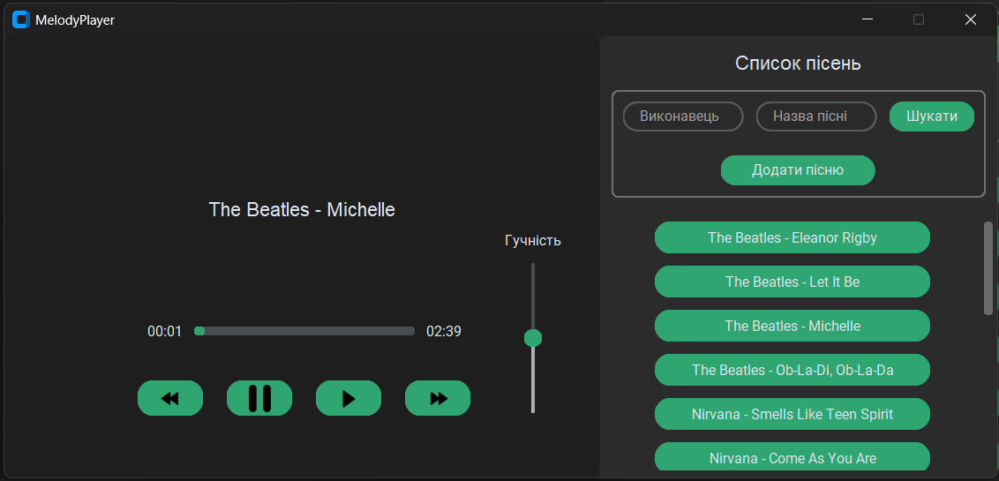

# 🎵 MelodyPlayer

**MelodyPlayer** - простий і зручний медіаплеєр із графічним інтерфейсом на базі CustomTkinter, що дозволяє програвати, переглядати й фільтрувати ваші улюблені треки.

---
## 🚀 Особливості проєкту

- Відтворення музичних файлів .mp3 з локальної бази.

- Підключення до бази даних SQLite для зберігання треків.

- Стильний сучасний інтерфейс з CustomTkinter.

- Виведення інформації про пісню: виконавець, назва, тривалість.

- Кнопки керування: ▶️ Play, ⏸ Pause, ⏭ Next, ⏮ Previous.

- Прогрес-бар пісні, що оновлюється в реальному часі.

- Бібліотека треків у вигляді списку з прокруткою.

---
## Як це працює?

1. При запуску застосунок зчитує список пісень із бази даних SQLite.

2. Користувач бачить інтерфейс із трьома головними панелями:

    - Контрольна панель — кнопки керування плеєром (спочатку приховані).

    - Скрол-панель — список усіх пісень.

    - Службова панель — фільтрація треків та кнопка для вікдриття модального вікна - додавання треку.

3. При натисканні на трек (кнопки) — з'являється контрольна панель та починається/зупиняється відтворення.

4. Прогрес-бар оновлюється щосекунди для зручності.

5. Усі назви, виконавці та тривалість автоматично відображаються з бази.

---
## Інтерфейс

> На головному екрані: панель керування, список пісень і прогрес-бар.

> На модальному вікні: поля для введення виконавця та назви треку, а також кнопки для додавання файлу 

---
## 🛠 Використані технології

- **CustomTkinter** — сучасний UI для Tkinter

- **Pygame** — для роботи зі звуком

- **SQLAlchemy** — ORM для роботи з SQLite

---
## 🧑‍💻 Розробник

- Ім’я: Гліб Пронін
- Роль: Розробник застосунку медіаплеєра
- GitHub: [glib-pronin](https://github.com/)

---
## 📦 Установка та запуск

1. клонування репозиторію:
```
git clone <тут посилання>
cd melodyplayer
```

2. Встановлення залежностей:  
```
pip install -r requirements.txt
```

3. Запуск:  
```
python main.py
```
